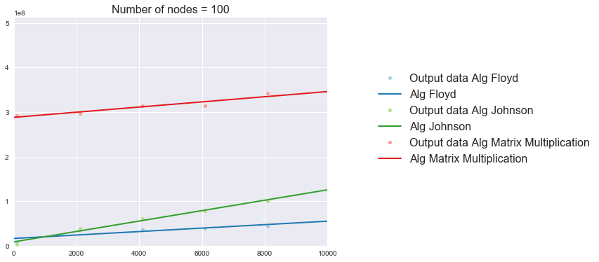
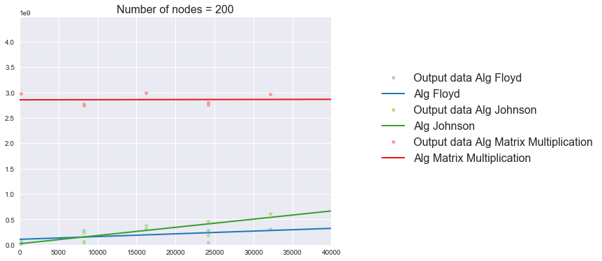
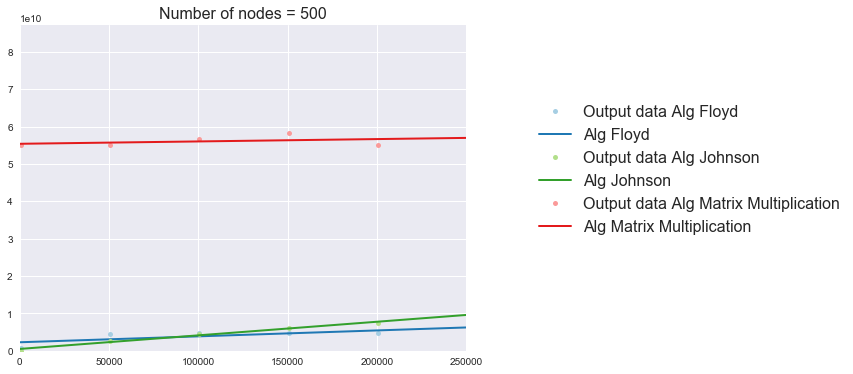
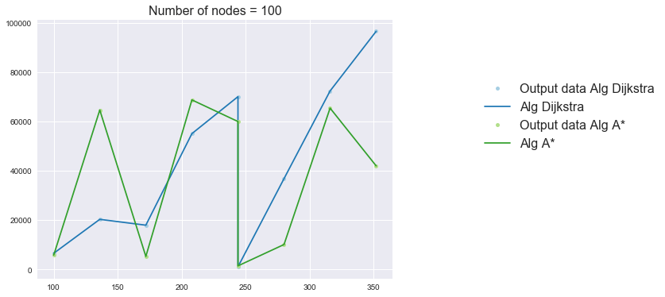
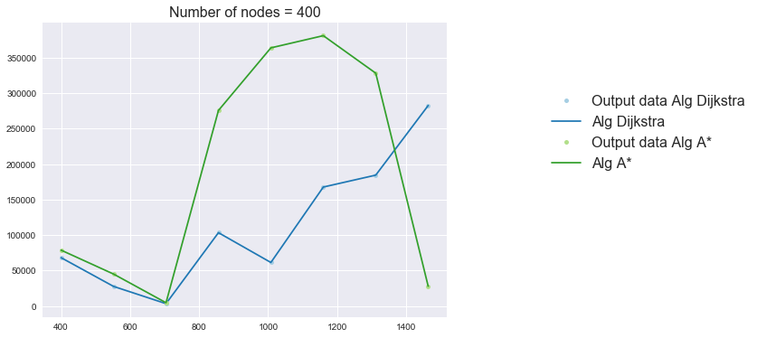
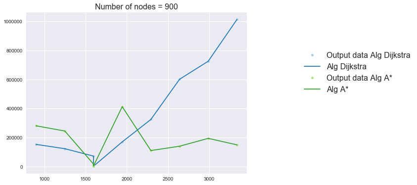
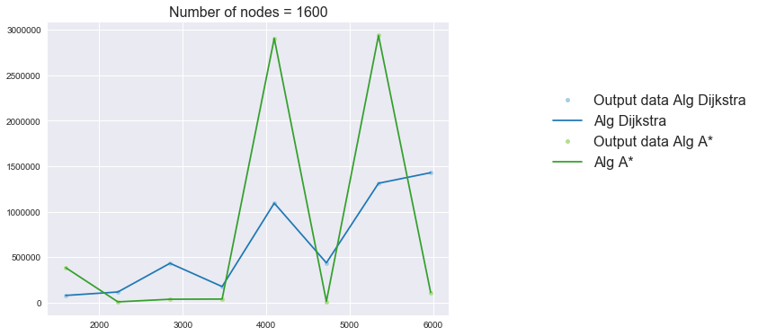
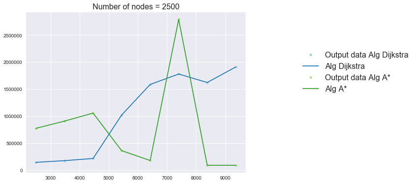

```c++
#include "general.h"
#include "Graph.h"
#include "algs/AlgFloyd.h"
#include "algs/AlgJohnson.h"
#include "algs/AlgMatrixMultiplication.h"
#include "algs/AlgAStar.h"
```

```c++
vector<Graph *> graphs_AStar = readGraphs("graphs_for_AStar", true);
```


```c++
vector<Graph *> graphs = readGraphs("graphs");
```

# Лабораторная работа #2

<em>main.cpp</em> - файл содержит код для замеры времени работы алгоритмов (замеры выводятся в файлы results/time_{alg_name}.txt)

<em>algs</em> - директория содержит реализации алгоритмов

<em>graphs</em> - директория содержит случайные графы для тестирования алгоритмов (кроме A*)

<em>graphs_for_AStar</em> - директория содержит случайные графы для тестирования алгоритма А*

<em>imgs</em> - директория содержит графики времени работы

<em>results</em> - директория содержит вывод замеров

<em>notebooks</em> - директория содержит отчет, код для рисования графиков

### Тестирование алгоритмов

Алгоритмы были протестированы на тестах задач (сайт <em>acmp.ru</em>):
- алгоритм Дейкстры - <a href="https://acmp.ru/index.asp?main=task&id_task=132">ссылка на задачу (11 тестов, id посылки 12692337)</a>
- алгоритм Форда-Беллмана - <a href="https://acmp.ru/index.asp?main=task&id_task=138">ссылка на задачу (51 тестов, id посылки 12680980)</a>
- алгоритм Флойда; алгоритм Джонсона; поиск кратчайших путей через матричное умножение - <a href="https://acmp.ru/index.asp?main=task&id_task=135">ссылка на задачу (17 тестов, id посылок 8661843, 12681043, 12681505)</a>
- алгоритм А* - тестирование на случайных графах (вершины - клетки сетки n x n, ребра добавлялись случайно, но только между соседними клетками); эвристическая функция - манхэттенское расстояние; проверка результатов с помощью алгоритма Форда-Беллмана.

Тестирование алгоритма А*:


```c++
int errors = 0, repeats = 10;

srand(time(nullptr));

for (int i = 0; i < repeats; i++) 
    for (auto graph : graphs_AStar) {

        vector<int> ans_BellmanFord;

        Time time1, time2;
        int ans_astar;
        bool ignore;
        
        int s = rand() % graph->numNodes;
        int t = rand() % graph->numNodes;
        
        tie(ans_BellmanFord, time1, ignore) = AlgBellmanFord(graph->edges, graph->numNodes, s);
        tie(ans_astar, time2) = AlgAStar(graph, s, t);

        if (ans_astar != ans_BellmanFord[t])
            errors++;

    }

cout << "Доля ошибок: " << double(errors)/(repeats * graphs.size());
```

    Доля ошибок: 0

### Сравнение времени работы

Для сравнение времени работы были использованы случайные графы (все веса в графах положительные):

#### Сравнение алгоритма Джонсона, алгоритма Флойда и ПКП через матричное умножение

По оси ОХ кол-во ребер в графе; по оси OY время работы.







<b>Вывод:</b> Matrix Multiplication работает медленнее всех (так как умножение матриц было реализовано за куб), 
алгоритм Джонсона работает быстрее алгоритма Флойда на разреженных графах и медленнее на плотных. 
Время работы алгоритма Флойда не зависит от кол-ва ребер в графе. Время работы алгоритма Джонсона линейно зависит от
кол-ва ребер в графе. Время работы Matrix Multiplication не завесит от кол-ва ребер.

#### Сравнение алгоритма A*  и алгоритма Дейкстры

По оси ОХ кол-во ребер в графе; по оси OY время работы.







<b>Вывод:</b> в некоторых случаях алгоритм А* работает значительно быстрее алгоритма Дейкстры.

<br>
